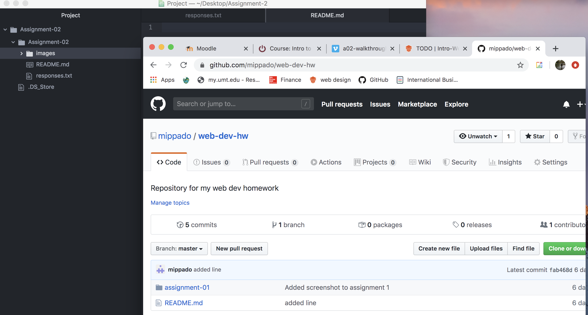

# Assignment-02
## Michael Matthews

I decided to take this class because I would learn how to design websites in the future to add skills to my marketing degree. I think that the vast majority of marketing will be done online by the time I graduate, so knowing web design skills will give my marketing career a leg up. There are plenty of good businesses throughout Montana, including a business I would eventually like to start, that have great ideas and great stores, but are just lacking a solid website and online presence. Learning about web design will allow me to help out many people and always be available for work.

List of three things I have learned
- How data travels online.
- What the internet is.
- What a cookie is.

[Frontier Anglers](https://www.frontieranglers.com/)

[My responses file](./responses.txt)

