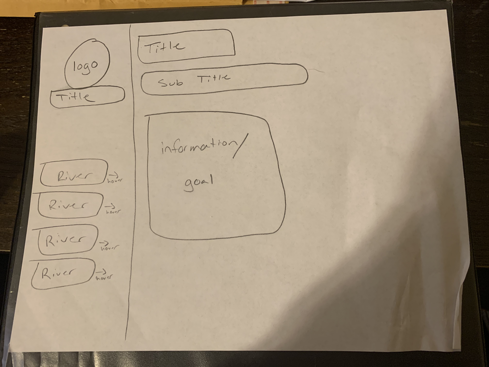

1. Padding is the amount of space between the inner content of the element and the element itself, margin is the space between the box/element and other elements, or the edge of the parent element, and borders are a color (with your choice of design) around text or content.

2. 

3. For this assignment I first thought about what I would want to make a website about. I love to fly fish and would love to start my own company one day, so that is what I went with. I had to begin by adding my title, and content I wanted with my title, logo, pages and description. From there I used css to get everything to look the way I wanted. It is a simple layout but I think that it looks nice and professional. 
